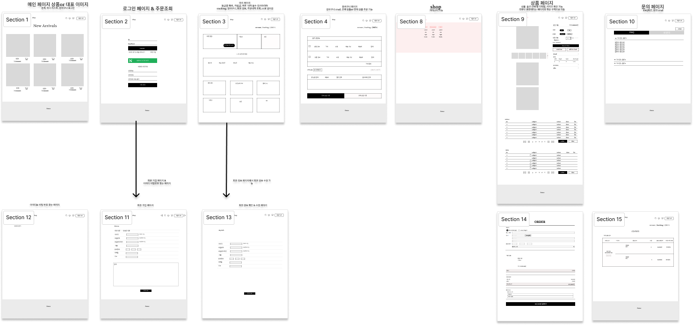

# ELICE CLOUD 트랙 2기 TEAM PROJECT.2
  
- **`팀 명` :** Team_1
- **`프로젝트 명` :** Web Shopping Mall 제작
- **`프로젝트 기간` :** 2024.03.25 - 2024.04.19
- **`한줄 소개` :** 여성 전용 의류 판매 쇼핑몰 사이트
- **`팀원` :** 조규은(팀장), 조부건, 정원기, 정지용, 홍유나
- **`배포 링크` :** http://34.64.51.12/
    

## 💼 Team

|                           조규은 (팀장)                            |                                                  조부건                                                  |                                             정원기                                              |                                         정지용                                         |                                       홍유나                                        |
|:----------------------------------------------------------------:|:-----------------------------------------------------------------------------------------------------:|:--------------------------------------------------------------------------------------------:|:-----------------------------------------------------------------------------------:|:--------------------------------------------------------------------------------:| 
| 
- 로그인  - 회원가입 - 회원 기능 구현  - 예외처리 전역화 | 
- ERD 제작   - 관리자 상품 관리 페이지 및 기능   - 관리자 카테고리 관리 페이지 및 기능   - 사용자 상품 관리 기능 | 
- 카테고리 기능   - 메인 페이지   - 상품 상세 페이지 및 조회 기능   - 프론트 장바구니 CRUD 기능  | 
- PPT 제작   - 발표 및 시연   - 전반적인 프론트 코드 개선   - 주문 및 배송 기능  | 
- 와이어 프레임 제작   - 상품 주문 기능   - 배송지 관리 기능   - 주문 관리 기능 |

 

###  ⚙️ **Tools** 

|                                                   Github                                                    |                                                                                       Discord                                                                                        |                                                                                   Notion                                                                                    |
| :---------------------------------------------------------------------------------------------------------: | :----------------------------------------------------------------------------------------------------------------------------------------------------------------------------------: | :-------------------------------------------------------------------------------------------------------------------------------------------------------------------------: |
|  |  |  |

 

###  🖥 **Front-end** 

|  JavaScript |  React |   Axios  |
| :-----------------------------------------------------------------------------------------------------------------------------------------------------------: | :--------------------------------------------------------------------------------------------------------------------------------------------------------------: | :----------------------------------------------------------------------------------------------------------------------------------------------------------------------------------------------------------------------------------------------------------: |
| 

 | 

 | 

 |
 

### 🔒 **Back-end** 

|                                                                              Java                                                                               |                                                                              mySQL                                                                               |                                                                         Spring                                           |                                                 Spring Boot JPA                                                 |                                                                                 JWT                                                                                  |                                                            Spring Security                                                            |
| :-------------------------------------------------------------------------------------------------------------------------------------------------------------: | :--------------------------------------------------------------------------------------------------------------------------------------------------------------: | :----------------------------------------------------------------------------------------------------------------: | :----------------------------------------------------------------------------------------------------------------: | :------------------------------------------------------------------------------------------------------------------------------------------------------------------: | :---------------------------------------------------------------------------------------------------------------------------------------: |
| 

 | 

 |  |  |  |  |

 

## ERD

 

## WireFrame

 